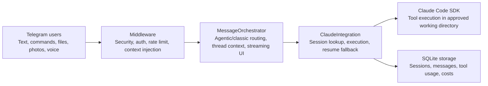
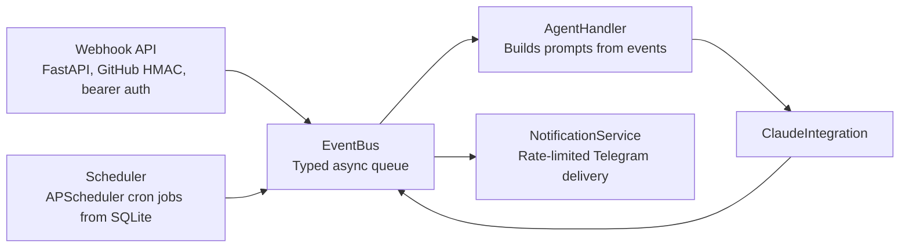

# Telechat Architecture

A Python 3.11+ async service that exposes Claude Code through Telegram, with optional webhook, scheduler, notification, project-thread, storage, and security layers.

| Metadata | Value |
| --- | --- |
| Repository | `telechatai/telechat` |
| Package version | `1.6.0` |
| Entry point | `claude-telegram-bot` / `src.main:run` |
| Generated | `2026-05-16` |

## Executive Summary

The application is built around one composition root, `src/main.py`, which creates configuration, storage, security, Claude SDK integration, an event bus, Telegram handlers, and optional background services. Direct Telegram chat and automation triggers ultimately converge on the same Claude execution path: `ClaudeIntegration.run_command()`.

Core traits:

- **Primary interface:** Telegram bot using `python-telegram-bot`, with polling or webhook delivery.
- **Agent runtime:** `claude-agent-sdk` client with tool allowlists, sandbox options, streaming, retry, and resume.
- **Persistence:** SQLite via `aiosqlite` stores users, sessions, messages, tool use, jobs, webhooks, and project topics.
- **Key design choice:** external automation, scheduled jobs, and direct chat are decoupled from delivery by the event bus and notification service.

## Runtime Topology

### Telegram Interaction Path

### Automation Path

## Component Map

| Area | Key modules | Responsibility |
| --- | --- | --- |
| Composition and lifecycle | `src/main.py` | Loads settings, constructs dependencies, starts bot, API server, event bus, notifications, scheduler, and handles shutdown. |
| Telegram bot | `src/bot/core.py`, `src/bot/orchestrator.py`, `src/bot/handlers/*` | Builds the Telegram application, registers commands and message handlers, injects dependencies, and routes updates by mode. |
| Claude integration | `src/claude/facade.py`, `src/claude/sdk_integration.py`, `src/claude/session.py` | Creates or resumes sessions, invokes Claude Code SDK, streams progress, tracks cost and tool usage, and handles SDK/CLI errors. |
| Security | `src/security/*`, `src/bot/middleware/*`, `src/events/middleware.py` | Validates users, paths, commands, rate limits, audit events, and event-origin constraints. |
| Events and automation | `src/events/*`, `src/api/server.py`, `src/scheduler/scheduler.py`, `src/notifications/service.py` | Normalizes webhooks and cron jobs into typed events, runs agent work, and delivers responses asynchronously. |
| Persistence | `src/storage/database.py`, `src/storage/repositories.py`, `src/storage/facade.py` | Initializes SQLite schema, provides repository access, and stores operational state. |
| Project routing | `src/projects/registry.py`, `src/projects/thread_manager.py` | Loads YAML project definitions and reconciles Telegram forum/private topics to project directories. |
| Optional capabilities | `src/bot/features/*`, `src/mcp/telegram_server.py` | Voice, image, files, Git integration, quick actions, session export, conversation mode, and MCP integration. |

## Startup Sequence

1. `src.main:run` calls `asyncio.run(main())`.
2. Settings are loaded through Pydantic from environment variables and an optional config file.
3. `create_application()` initializes SQLite storage and security providers.
4. Claude SDK manager and session manager are wrapped by `ClaudeIntegration`.
5. The event bus, event security middleware, and agent handler are registered.
6. `ClaudeCodeBot` is created with dependencies and later initialized to build the Telegram application.
7. `run_application()` wires services that need the Telegram `Bot` instance: project topics, notifications, API server, and scheduler.
8. Shutdown is ordered as scheduler, notifications, event bus, bot, Claude integration, then storage.

## Telegram Request Flow

### Agentic Mode

The default mode keeps the Telegram interface conversational. Known commands include `/start`, `/new`, `/status`, `/verbose`, `/repo`, and `/restart`. Unknown slash commands are passed through to Claude instead of being rejected.

Text, document, photo, and voice handlers live in `MessageOrchestrator`. Active requests are tracked per user so a stop callback can interrupt a running Claude SDK task.

### Classic Mode

When `AGENTIC_MODE=false`, routing delegates to the legacy command and callback handlers under `src/bot/handlers`. This exposes terminal-style navigation, session control, quick actions, git commands, and export commands.

Both modes share middleware, storage, security, Claude integration, and current-directory state conventions.

## Claude Execution Flow

1. The bot calls `ClaudeIntegration.run_command(prompt, working_directory, user_id, ...)`.
2. If no explicit session is supplied and this is not a forced new session, the latest non-expired session for the user and directory is selected.
3. `SessionManager` creates or loads session state through `SQLiteSessionStorage`.
4. `ClaudeSDKManager.execute_command()` builds `ClaudeAgentOptions` with cwd, model, budget, max turns, tools, sandbox, MCP servers, and system prompt.
5. The SDK client sends a text or multimodal prompt and reads streamed messages until a result message arrives.
6. Tool calls, costs, duration, turn count, output text, and Claude session ID are extracted.
7. The session is updated; if resume fails, stale session state is removed and the command retries as a fresh session.

Every Claude run starts with a directive that file operations must remain inside the current working directory and use relative paths. If a project `CLAUDE.md` exists, it is appended to the system prompt.

## Data Model

SQLite is initialized by migrations embedded in `src/storage/database.py`. The schema is operational rather than domain-heavy; it stores bot usage, agent sessions, automation, and topic routing state.

| Table or view | Purpose |
| --- | --- |
| `users` | Telegram user metadata, allowance flag, aggregate cost/message/session counts. |
| `sessions` | Claude session ID per user and project path with cost and activity metadata. |
| `messages` | Prompt, response, duration, cost, and error details for each conversation turn. |
| `tool_usage` | Claude tool name, input, success flag, and related message/session IDs. |
| `audit_log` | Security and access events. |
| `user_tokens` | Optional token-auth material. |
| `cost_tracking` | Per-user daily request and cost totals. |
| `scheduled_jobs` | Persisted cron jobs that emit scheduled agent events. |
| `webhook_events` | Webhook audit and delivery deduplication by delivery ID. |
| `project_threads` | Mapping between configured projects and Telegram topic IDs. |
| `daily_stats`, `user_stats` | Convenience analytics views over stored activity. |

## Security Architecture

| Control | Implementation |
| --- | --- |
| User authentication | Whitelist authentication is enabled when `ALLOWED_USERS` is configured. Token auth can be added through `ENABLE_TOKEN_AUTH`. |
| Directory boundary | `SecurityValidator` constrains file paths under `APPROVED_DIRECTORY` and supports project-root checks. |
| Tool permission gate | The SDK `can_use_tool` callback denies file or bash operations that break path or directory rules. |
| Rate limiting | Bot middleware and notification delivery include request and per-chat throttling controls. |
| Webhook verification | GitHub uses HMAC-SHA256; generic providers require a shared bearer secret. |
| Secret redaction | Verbose tool output is scrubbed for common token, key, credential, and auth-header patterns. |

Production note: in development mode, the application can fall back to an allow-all whitelist if no auth provider is configured. Production deployments should always configure explicit allowed users or token authentication.

## Configuration Surface

`src/config/settings.py` centralizes environment-driven configuration. The most architecturally significant settings are:

| Category | Settings |
| --- | --- |
| Telegram | `TELEGRAM_BOT_TOKEN`, `TELEGRAM_BOT_USERNAME`, webhook URL/port/path, reply quoting. |
| Security | `APPROVED_DIRECTORY`, `ALLOWED_USERS`, token auth, security-pattern and tool-validation toggles. |
| Claude | CLI path, API key, model, max turns, timeout, per-user/request cost caps, allowed/disallowed tools, retry policy. |
| Sandbox | Sandbox enablement and excluded commands such as git, npm, pip, poetry, make, and docker. |
| Features | MCP, git integration, file uploads, voice provider, quick actions, agentic mode, API server, scheduler, project threads. |
| Storage | `DATABASE_URL`, session timeout, max sessions per user. |

## Deployment View

The service is packaged as a Python application with a console entry point: `claude-telegram-bot = src.main:run`. Runtime dependencies include Telegram, Claude Agent SDK, FastAPI/Uvicorn, APScheduler, Pydantic Settings, structlog, SQLite, and optional Mistral/OpenAI voice providers.

- **Local or server process:** runs polling mode by default unless Telegram webhook settings are configured.
- **API sidecar in same process:** optional FastAPI server listens on `0.0.0.0` at the configured port.
- **Scheduler in same event loop:** APScheduler emits events into the shared event bus.
- **Database:** default SQLite file URL, with WAL enabled by migration 3.
- **Claude runtime:** uses API key if configured, otherwise relies on existing Claude CLI authentication.

## Extension Points

| Extension | How to add it |
| --- | --- |
| New Telegram command | Add a handler in `src/bot/handlers` or `MessageOrchestrator`, then register it in the mode-specific command list. |
| New event source | Create a typed event in `src/events/types.py`, publish it to `EventBus`, and subscribe a handler. |
| New proactive notification target | Subscribe to `AgentResponseEvent` or add a parallel delivery service similar to `NotificationService`. |
| New persistent entity | Add a migration in `DatabaseManager._get_migrations()`, a dataclass model, and repository methods. |
| New Claude tool policy | Update allowed/disallowed tool settings or extend the SDK `can_use_tool` callback validation. |
| New project routing model | Extend `ProjectRegistry` and `ProjectThreadManager`, preserving approved-directory validation. |

## Operational Notes

- All long-running runtime components share one asyncio event loop; failed tasks are logged and trigger shutdown handling when surfaced through `asyncio.wait(... FIRST_COMPLETED)`.
- Notification sending is queued and split at Telegram message-size boundaries.
- Webhook delivery deduplication is atomic through `INSERT OR IGNORE` on `delivery_id`.
- Project thread mode is strict: messages outside mapped topics are rejected with guidance instead of falling back to a default directory.
- Voice, image, file, Git, MCP, API server, scheduler, and project-thread behavior are feature-flagged by settings.

Source files reviewed for this document include `src/main.py`, `src/bot/core.py`, `src/bot/orchestrator.py`, `src/claude/facade.py`, `src/claude/sdk_integration.py`, `src/events/*`, `src/api/server.py`, `src/storage/*`, `src/projects/*`, `src/scheduler/scheduler.py`, and `src/notifications/service.py`.
